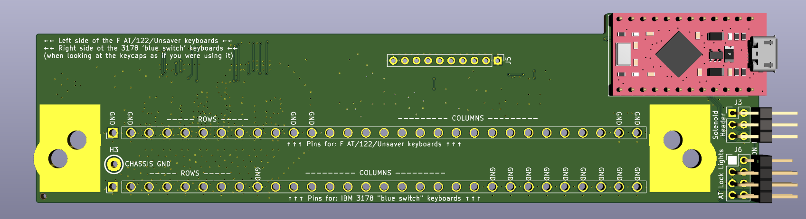
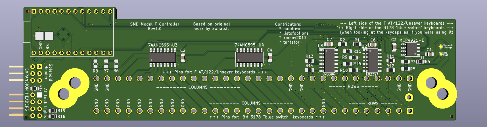

# SMD Model F controller based on TH Xwhatsit design. ('kishsaver' variant)

This variant is for IBM 4704 keyboards, aka 'kishsaver' class model F keyboards, like F107, F50, F62, F77
This variant is not 100% compatible with the https://www.modelfkeyboards.com/ recreations of the F62/F77, because the pin pitch is different,
although it is electrically compatible with those too, if one decides to wire it up with individual wires.

For other variants see:
* https://github.com/purdeaandrei/SMDModelFController/tree/extra_columns
* https://github.com/purdeaandrei/SMD4704KishsaverClassModelFController
* https://github.com/listofoptions/TH-XWhatsIt

## Images

## Origins and license

This project is based on the Through-hole xwhatsit by listofoptions, which is un turn
based on the capsense controllers by XWhatsIt
(Tom Wong-Cornall). original liscencure holds, as well as CERN OSH
(compatible license).

original implementation of Tom Wong-Cornall's controller documented here

http://downloads.cornall.co/ibm-capsense-usb-web/ibm-capsense-usb.html

Working theory of operation is under the previous link.

