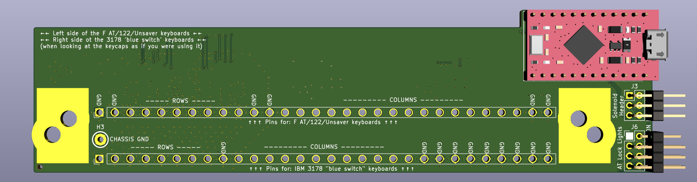

# SMD Model F controller based on TH Xwhatsit design. ('custom' variant)

This variant has an additional shift register, for custom projects, to support up to 24 columns, by manual wiring.

## Images

## Origins and license

This project is based on the Through-hole xwhatsit by listofoptions, which is un turn
based on the capsense controllers by XWhatsIt
(Tom Wong-Cornall). original liscencure holds, as well as CERN OSH
(compatible license).

original implementation of Tom Wong-Cornall's controller documented here

http://downloads.cornall.co/ibm-capsense-usb-web/ibm-capsense-usb.html

Working theory of operation is under the previous link.

